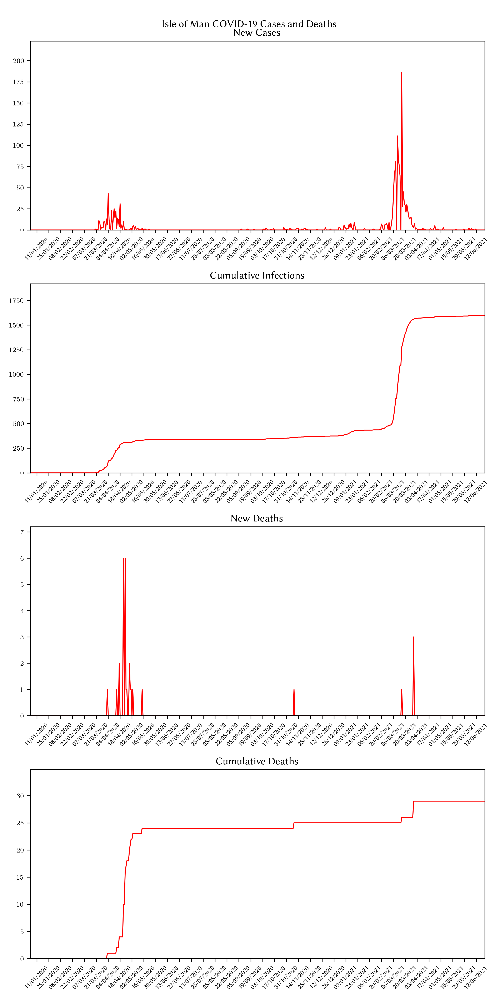

# Isle of Man Outbreak
Between February 2021 and April 2021, the Isle of Man experienced a sudden and severe outbreak of
COVID-19 cases. This can be seen in the figures below which represent the World Health Organisation's
COVID-19 data for the Isle of Man.

We will create a simulation of the COVID-19 pandemic between the 1st February 2021 and 30th April 2021 and
see whether the predicted outcomes match the true data.

